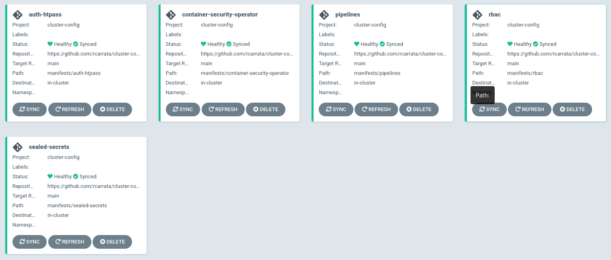
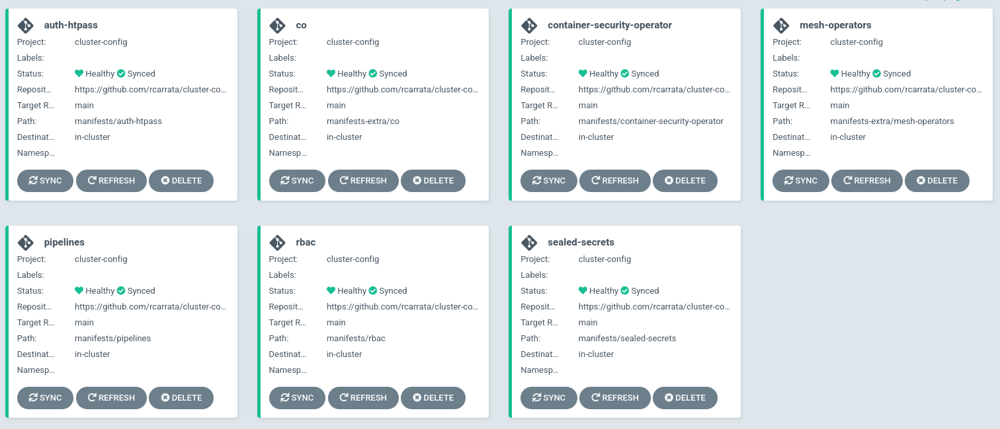

# Cluster Config

Cluster Config of Openshift4 Clusters using GitOps

## Clone the repo

```
git clone https://github.com/rcarrata/cluster-config.git
cd cluster-config
```

## Install Openshift GitOps with Dex OAuth

```
until oc apply -k bootstrap/; do sleep 2; done
```

## Deploy the Cluster Config in ArgoCD (using ApplicationSets)

Deploy basic Cluster Configuration:

- Htpasswd Auth
- RBAC Openshift
- Openshift Pipelines
- Sealed Secrets
- Container Security Operator

```
oc apply -k cluster-config/config/overlays/default/
```




## Deploy the Cluster Extra Config in ArgoCD (using ApplicationSets)

Deploy extra Cluster Configuration:

- Compliance Operator
- Service Mesh Operators

```
oc apply -k cluster-config/config/overlays/extra
```


